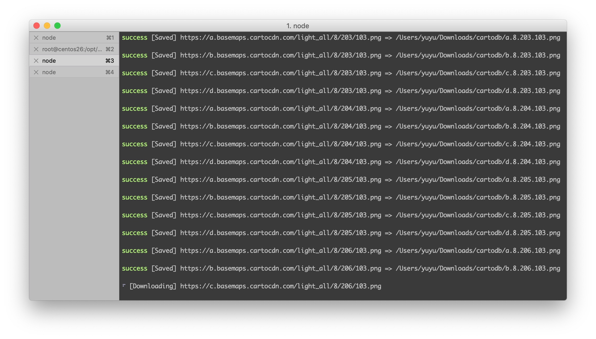

# n-downloader

> download file



### Install
```
npm install n-downloader
```

### Usage
```
const url = 'http://pic37.nipic.com/20140113/8800276_184927469000_2.png';

download(url, 'dist');
```
[More examples...](example.js)

### API

##### download(url, [destination], [options])

- **url** `string`: URL to download.
- **destination** `string`: File path or dirname where your file will be saved.
- **options** `Object`
  - *logger* `Object`
    - logLevel `number`: Default is 3
  - *request* `Object`
    - Same options as [`got`](https://github.com/sindresorhus/got#options).

### License
MIT
